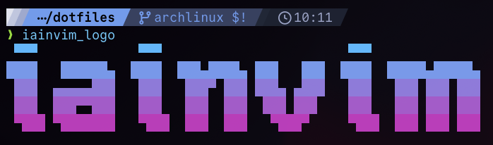

When I first started really customising my Neovim config to my own personal preferences, one of the things I did to really make it feel like my own was to add a custom dashboard logo.

I settled on the name `iainvim` for my config, being based obviously on my first name but also cheekily containing `nvim` within the name.

My initial logo was ~~shamelessly stolen~~ heavily inspired by [Josh Medeski](https://www.joshmedeski.com/), who used this [Text to ASCII Art Generator](https://patorjk.com/software/taag/) (built on top of the excellent [FIGlet](https://www.figlet.org/) tool) to create ASCII art style logos for many of the config files in his [dotfiles](https://github.com/joshmedeski/dotfiles).

Here was mine (if you use [LazyVim](https://www.lazyvim.org/) or the [snacks.nvim dashboard](https://github.com/folke/snacks.nvim/blob/main/docs/dashboard.md), this will look familiar):

```
 
 ██╗ █████╗ ██╗███╗   ██╗██╗   ██╗██╗███╗   ███╗ 
 ██║██╔══██╗██║████╗  ██║██║   ██║██║████╗ ████║ 
 ██║███████║██║██╔██╗ ██║██║   ██║██║██╔████╔██║ 
 ██║██╔══██║██║██║╚██╗██║╚██╗ ██╔╝██║██║╚██╔╝██║ 
 ██║██║  ██║██║██║ ╚████║ ╚████╔╝ ██║██║ ╚═╝ ██║ 
 ╚═╝╚═╝  ╚═╝╚═╝╚═╝  ╚═══╝  ╚═══╝  ╚═╝╚═╝     ╚═╝
 
```

Back then I used [dashboard-nvim](https://github.com/nvimdev/dashboard-nvim) and here is what that code looked like:

```lua
return {
  "nvimdev/dashboard-nvim",
    event = "VimEnter",
    dependencies = { { "nvim-tree/nvim-web-devicons" } },
    opts = function()
      -- Logo generated from:
      -- https://patorjk.com/software/taag/#p=display&f=ANSI%20Shadow&t=iainvim
      local logo = [[
██╗ █████╗ ██╗███╗   ██╗██╗   ██╗██╗███╗   ███╗
██║██╔══██╗██║████╗  ██║██║   ██║██║████╗ ████║
██║███████║██║██╔██╗ ██║██║   ██║██║██╔████╔██║
██║██╔══██║██║██║╚██╗██║╚██╗ ██╔╝██║██║╚██╔╝██║
██║██║  ██║██║██║ ╚████║ ╚████╔╝ ██║██║ ╚═╝ ██║
╚═╝╚═╝  ╚═╝╚═╝╚═╝  ╚═══╝  ╚═══╝  ╚═╝╚═╝     ╚═╝
      ]]

      logo = string.rep("\n", 8) .. logo .. "\n\n"
      local opts = {
        theme = "doom",
        config = {
          header = vim.split(logo, "\n"),
        },
      }

   return opts
    end,
}
```

I later moved to using [the snacks.nvim dashboard](https://github.com/folke/snacks.nvim/blob/main/docs/dashboard.md) and used a new logo generated with this Go-based TUI: [superstarryeyes/bit](https://github.com/superstarryeyes/bit)

And it looked a bit like this:

```

  ▀▀▀             ▀▀▀                        ▀▀▀               
 ████   ██████▄  ████  ███▄████▄ ███   ███  ████  █████▄█████▄ 
  ███  ▄▄▄▄▄███   ███   ███▀ ███ ███▄ ▄███   ███   ███ ███ ███ 
  ███  ███▀▀███   ███   ███  ███  ███ ███    ███   ███ ███ ███ 
  ▀███ ▀███████   ▀███  ███  ███   ▀███▀     ▀███  ███ ███ ███ 

```

Which might have been fine to leave it at that, but I wanted a little something extra.

The `bit` TUI can be used to generate a bash script that uses ANSI escape sequences to output colour.

> [!tip]
> Here's a good article explaining ANSI escape sequences that has helped me manually add them in other bash scripts: [Bash Colors | ShellHacks](https://www.shellhacks.com/bash-colors/)

The generated script, saved as `iainvim_logo` and included in the `PATH`, looks like this:

```bash
#!/bin/bash
# Generated Bash ANSI Art

ansi_art_lines=(
    " ▀▀▀             ▀▀▀                        ▀▀▀              "
    # ... and much more for the other lines here
)

display_ansi_art() {
    for line in "${ansi_art_lines[@]}"; do
        echo -e "$line"
    done
}

# Call the function
display_ansi_art
```

And ends up producing a logo like this:



Which can then be used as a terminal section command in the `snacks.nvim` dashboard like so:

```lua
return {
  "folke/snacks.nvim",
  priority = 1000,
  lazy = false,
  opts = {
    -- ...
    dashboard = {
      -- ...
      sections = {
        {
          section = "terminal",
          cmd = "iainvim_logo",
          height = 5,
          width = 61,
          padding = 1,
        },
        { icon = " ", title = "Keymaps", section = "keys", indent = 2, padding = 1 },
        { section = "startup" },
      },
    },
  },
}
```

And you get a result like this:

![[attachments/iainsimmons_neovim_dashboard_2025-11-23.png|Neovim dashboard with gradient logo]]
