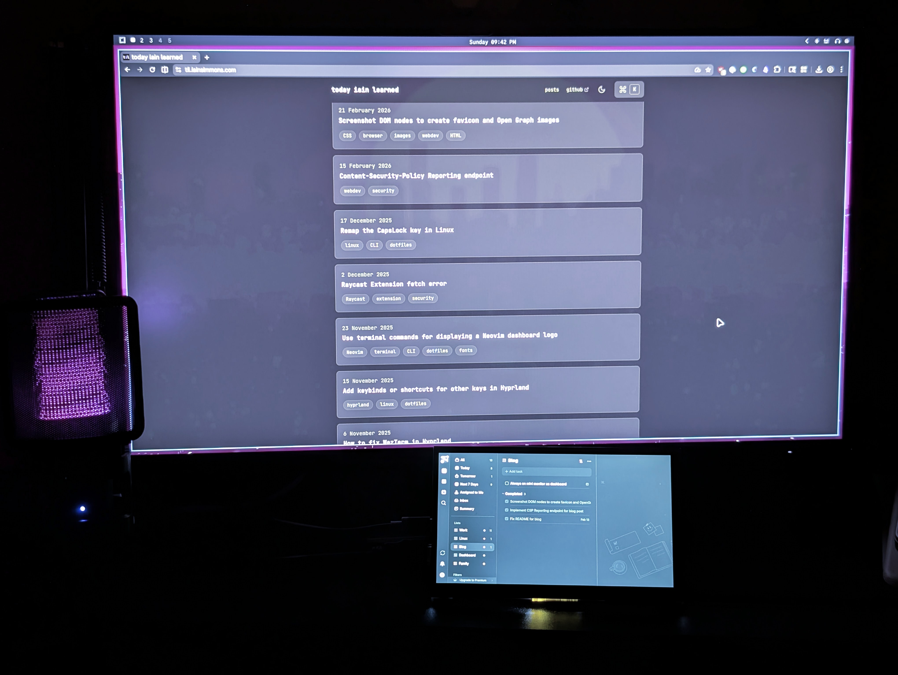

Recently I've wanted to be more organised with my to-do list, especially at work, but also for this blog.

I've tried a few different tools/applications for this, ranging from as simple as a single text/markdown file or a TODO markdown file in [Obsidian](https://obsidian.md), or a floating note in [Raycast](https://www.raycast.com/), all the way through to [daily notes](https://help.obsidian.md/plugins/daily-notes) in Obsidian with a complex system involving the [dataview](https://github.com/blacksmithgu/obsidian-dataview), [QuickAdd](https://github.com/chhoumann/quickadd) and [Templater](https://github.com/MeredithClikkie/Obsidian_Templater) plugins.

Most of these had some drawbacks that meant they either were not available where/when I needed them (e.g. only on one device) or involved too much overhead to be useful.

So I eventually settled on a dedicated service for my to-do/task list: [TickTick](https://ticktick.com). I had used TickTick long, long ago, and was pleasantly surprised to see they were still going strong and had made a lot of improvements in their UI and feature set. It is available on pretty much everything, including my Android phone, which is key to being able to quickly add things when I'm not at a computer.

But there was one other thing that always bugged me about all of these solutions that potentially a simple paper-based list would have solved: being able to always glance at the list at any point to see what was on it and quickly mark things off as I completed them.

I set out to build something mostly with things I already had available, and one new, key piece of hardware: a small touchscreen monitor. I found one on Amazon (AU) for a decent price, the [GeeekPi 7-Inch IPS LCD Touch Screen](https://www.amazon.com.au/dp/B0CJWXWJ6K).

> It would have been nice to get a e-paper/e-ink screen, but they were fairly expensive for what they were, and even more so for a touch-enabled one. I even considered trying to make my own DIY equivalent of the [TRMNL](https://trmnl.com/)  device, though it is only for viewing information, and not controlling anything. It is also fairly expensive for something that isn't fully open and configurable.

In any case, I first attempted to connect the mini-monitor to an old Raspberry Pi 3B my brother gave me, but it was already not working well, and it seemed to really struggle keeping up, so I quickly abandoned that.

I also tried connecting it to my work MacBook Pro directly, but managing a 3rd screen (laptop screen, external monitor, and then the mini-monitor) was painful and the touchscreen functionality didn't work at all. Window management was especially annoying.

So it was clear my mini PC running Arch Linux and [Hyprland](https://hypr.land/) (via [Omarchy](https://omarchy.org/)) was the way to go so I could effectively manage the mini-monitor with its own workspace. It worked out of the box, but needed a decent bit of Hyprland configuration to get it just how I wanted it.

First up, I needed the touchscreen to only detect input for the monitor it was on (I originally had the mini-monitor connected to my second HDMI port but then it didn't run as well as the only connected monitor when I wanted that):

```txt title="~/.config/hypr/hyprland.conf"
input {
  touchdevice {
    output = HDMI-A-1
    enabled = true
  }
}
```

Next, in the auto-positioning from Hyprland, the mini-monitor was positioned to one side of my main monitor. So I positioned it and set the specific resolution I wanted (aiming for a scale large enough to quickly glance at and tap to check off tasks, but still display a decent amount of information):

```txt title="~/.config/hypr/hyprland.conf"
# See https://wiki.hyprland.org/Configuring/Monitors/
# List current monitors and resolutions possible: hyprctl monitors
# Format: monitor = [port], resolution, position, scale
env = GDK_SCALE, 1
monitor = HDMI-A-1, 1024x600, 600x1080, 1
monitor = HDMI-A-2, preferred, 0x0, 1
```

I then needed to configure the mini-monitor to use its own workspace, and also force the web app version of TickTick to always open in that workspace:

```txt title="~/.config/hypr/hyprland.conf"
workspace = 1, monitor:HDMI-A-2, default:true
workspace = 2, monitor:HDMI-A-2
workspace = 3, monitor:HDMI-A-2
workspace = 4, monitor:HDMI-A-2
workspace = 5, monitor:HDMI-A-2
workspace = 6, monitor:HDMI-A-2
workspace = 7, monitor:HDMI-A-2
workspace = 8, monitor:HDMI-A-2
workspace = 9, monitor:HDMI-A-2
workspace = 10, monitor:HDMI-A-1, default:true
```

In that same file, I also configured TickTick to open fullscreen, to stay on (i.e. not show the screensaver or go idle) while in fullscreen mode (so I could still exit fullscreen if I _wanted_ Arch/Hyprland to go idle). Basically, running like a "kiosk" device, always ready to help:

```txt title="~/.config/hypr/hyprland.conf"
# workspace-10 = Tick Tick (tasks)
windowrule {
    name = tick-tick
    match:class = ^(?i).*ticktick.*

    workspace = 10
    monitor = HDMI-A-1
    fullscreen = on
    sync_fullscreen = on
    idle_inhibit = fullscreen
}
```

With the assumption that I always wanted this available, I set up a shell script (and put it in my `PATH`) that would check if the mini-monitor was connected, and if so, launch TickTick immediately.

```sh title="launch-tick-tick-on-mini-monitor.sh"
#!/bin/sh

MONITOR_MODEL="CL07-HDMI"

is_mini_monitor_connected=$(hyprctl monitors -j | jq -r --arg model "$MONITOR_MODEL" '.[] | select(.model == $model) | .model')

if [[ $is_mini_monitor_connected == "$MONITOR_MODEL" ]]; then
 omarchy-launch-webapp "https://ticktick.com/webapp/#q/all/tasks" &
fi

```

> [!note]
 > The script above assumes `jq` is available, and the `omarchy-launch-webapp` command is obviously from Omarchy, but you could do something similar with `grep` and a browser CLI command

I then added this so it would run on startup:

```txt title="~/.config/hypr/hyprland.conf"
exec-once = launch-tick-tick-on-mini-monitor
```

And the final piece of the puzzle was another shell script to cycle active workspaces _**without**_ going through the workspace shown on the mini-monitor. (I do confess, I needed a bit of assistance from Gemini to get this started, as I'm not that good with bash scripts):

```bash title="cycle-active-workspaces.sh"
#!/bin/bash

# Configuration: mini monitor's workspace ID to exclude
KIOSK_ID=10

# 1. Get a unique, sorted list of active workspace IDs that are NOT the kiosk
# Filter for IDs > 0 (ignores special workspaces) and < KIOSK_ID
mapfile -t active_workspaces < <(hyprctl clients -j | jq -r "[.[] | select(.workspace.id > 0 and .workspace.id < $KIOSK_ID) | .workspace.id] | unique | .[]" | sort -n)

# 2. Get the current workspace ID
current=$(hyprctl activeworkspace -j | jq '.id')

# 3. Find our current position in that array
index=-1
for i in "${!active_workspaces[@]}"; do
    if [[ "${active_workspaces[$i]}" == "$current" ]]; then
        index=$i
    break
fi
done

# 4. Handle edge cases (e.g., if on empty workspace not in the list)
count=${#active_workspaces[@]}
if [ "$count" -eq 0 ]; then exit 0; fi # Do nothing if no windows are open

if [ "$index" -eq -1 ]; then
    # If current isn't in the list, go to the first available workspace
    hyprctl dispatch workspace "${active_workspaces[0]}"
    exit 0
fi

# 5. Calculate next/prev with wrap-around math
if [ "$1" == "next" ]; then
    next_index=$(( (index + 1) % count ))
else
    next_index=$(( (index - 1 + count) % count ))
fi

# 6. Execute the jump
hyprctl dispatch workspace "${active_workspaces[$next_index]}"
```

And of course update my Hyprland bindings to use this:

```txt title="~/.config/hypr/hyprland.conf"
# Unbind Omarchy defaults
unbind = SUPER, TAB
unbind = SUPER SHIFT, TAB

# Previous bindings
# bind = SUPER, TAB, workspace, e+1
# bind = SUPER SHIFT, TAB, workspace, e-1

bind = SUPER, TAB, exec, cycle-active-workspaces next
bind = SUPER SHIFT, TAB, exec, cycle-active-workspaces prev
```

And here's what it looks like (taken at night to hide all the mess on my desk 😉):


