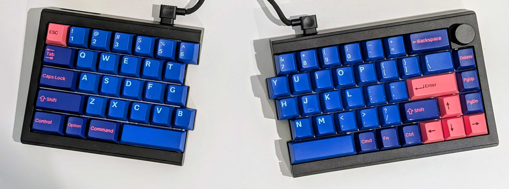

I recently received a new keyboard as a birthday gift, my first ***split*** mechanical keyboard (not an ortholinear though, baby steps!), the [Epomaker Split65](https://epomaker.com/products/epomaker-split-65). It's a great, affordable option, with a decent amount of features for the price (tri-mode wired/wireless/bluetooth, RGB lighting, hot-swappable switches, QMK/VIA programmable, and a good amount of sound dampening).

Here's a photo of the keyboard, with the [Keychron "Player" Cherry profile keycaps](https://www.keychron.com/collections/all-keycaps/products/cherry-profile-double-shot-pbt-full-set-keycaps-player) that I moved from my old Keychron V5:

In addition to being a split keyboard, it was also the smallest I had used, with the fewest keys. Moving from a 95% keyboard with a numpad and separate arrow key cluster, this was a lot more compact and took some getting used to.

I knew I would need another layer for the arrow keys, and because I already needed the first layer for the <kbd>F1</kbd> to <kbd>F12</kbd> keys, it made sense to just use that.

This keyboard supports QMK/VIA, so I fired up the [VIA app](https://usevia.app/) in my browser and [imported the JSON definition file for the Split65](https://epomaker.com/blogs/via-json/epomaker-split65-via-json-file). At first I thought of just trying to use the existing <kbd>Fn</kbd> key, but it's a little awkward to reach from the home row.

A little bit of searching around led me to [Epomaker's own guide to using VIA for advanced keymaps](https://epomaker.com/blogs/guides/via-usage-guide) and this in particular stood out to me:

> The `Space Fn(n)` function enables dual functionality for enhanced keyboard efficiency. A short press of the key outputs a single space, while a long press temporarily switches the keyboard to Layer `n`. Upon release, the keyboard automatically reverts to Layer `0`. This behavior mirrors the functionality of `MO(n)`, offering a convenient method for temporary layer switching while maintaining the primary function of the space key.

A bit of regular typing on the Split65 confirmed that I typically use the left spacebar (space key) as the primary one for actually adding a space. So I mapped the secondary (right side) spacebar to `Space Fn(1)` (space on tap, switch to layer 1 on hold).

I then added the following keymaps:

<kbd>FN</kbd> + <kbd>H</kbd>  => `Left Arrow`
<kbd>FN</kbd> + <kbd>J</kbd>  => `Down Arrow`
<kbd>FN</kbd> + <kbd>K</kbd>  => `Up Arrow`
<kbd>FN</kbd> + <kbd>L</kbd>  => `Right Arrow`
<kbd>FN</kbd> + <kbd>Space</kbd> => `Enter`

And then later, after watching/reading about the Emacs celebrity [Prot teaching streamer and Neovim user Linkarzu about Emacs](https://protesilaos.com/codelog/2026-07-04-emacs-for-beginners-with-linkarzu/), I stole his idea of adding layer 1 keymaps for the navigation keys:

<kbd>FN</kbd> + <kbd>Y</kbd>  => `Home`
<kbd>FN</kbd> + <kbd>U</kbd>  => `PgDn`
<kbd>FN</kbd> + <kbd>I</kbd>  => `PgUp`
<kbd>FN</kbd> + <kbd>O</kbd>  => `End`

And then finally I added `Backspace` and `Delete` to the left side home row too:

<kbd>FN</kbd> + <kbd>D</kbd>  => `Backspace`
<kbd>FN</kbd> + <kbd>F</kbd>  => `Delete`

You can find the [layout (exported as JSON) in my dotfiles](https://github.com/iainsimmons/dotfiles/blob/main/epomaker_split65.layout.json).
